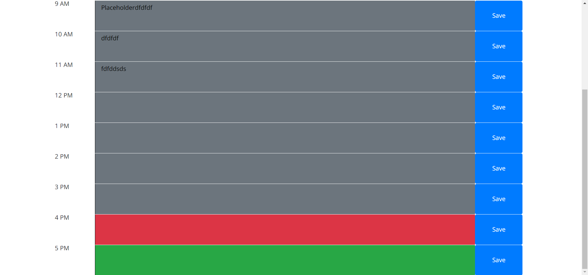

# Work-Day-Scheduler

## Purpose
Allow you to add items to your daily work schedule and have them persist when refreshing the page

## Features
* color coded hour blocks to show if they have passed or not
* editable text fields to add items to schedule
* pressing the save button lets you save the task so that it will persist in local storage

## Built with
* HTML
* CSS
* JavaScript
* Jquery
* Bootstrap
* moment.js

## Website 
https://matt11711.github.io/Work-Day-Scheduler/

## Contribution
Made with ❤️ by Matt11711